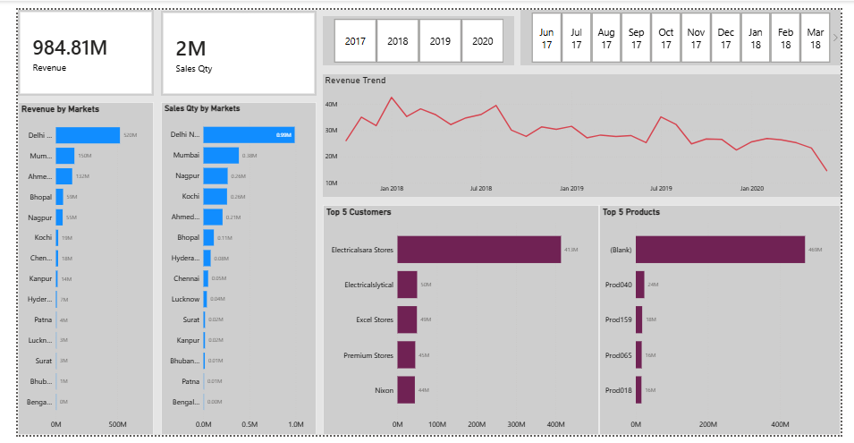

# 📊 Sales Insights Dashboard

  

## Overview

An interactive Sales Insights Dashboard built using **Power BI, MySQL, and Excel** to analyze revenue, sales quantity, customer performance, and market trends. The dashboard helps stakeholders monitor key business metrics and make data-driven decisions.

## 🚀 Key Features

* Revenue and Sales Quantity Tracking
* Market-wise Sales Analysis
* Customer Performance Analysis
* Time-based Trend Analysis
* Interactive Filters and Drill-downs
* KPI Monitoring Dashboard

## 🛠️ Tech Stack

* Power BI
* MySQL
* SQL
* Microsoft Excel

## 📂 Dataset

* Sales Transactions
* Customers
* Products
* Markets
* Date Table

📄 Dataset: [View Dataset](https://github.com/swainmishra15/Data-Analysis-Sales-Dashboard/blob/main/db_dump.sql)

## 📈 Dashboard Insights

* Identified top-performing markets by revenue.
* Analyzed customer contribution to overall sales.
* Tracked monthly and yearly revenue trends.
* Monitored sales quantity across different regions.
* Highlighted business growth opportunities through KPI analysis.

## 🔄 Workflow

1. Data Extraction from MySQL
2. Data Cleaning using Excel
3. Data Modeling in Power BI
4. KPI Creation and DAX Measures
5. Dashboard Development and Visualization

## 🎯 Skills Demonstrated

`Power BI` • `SQL` • `MySQL` • `Excel` • `Data Cleaning` • `Data Modeling` • `Business Intelligence` • `Data Visualization`

## Dashboard

🔗 [View Dashboard Image](https://github.com/swainmishra15/Data-Analysis-Sales-Dashboard/blob/main/Dashboard.png)

---
